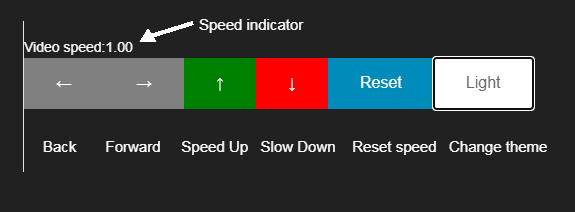

# BBB Buttons

BBB Buttons is a sigle file script for adding media-playback controls to BigBlueButton recordings.
From students, for students.
Feel free to PR if I see it, I will definitely consider it.

Now available as a Chrome extension and Firefox add-on. Check [here](https://github.com/Kotesitory/bbb_buttons_extensions).

# Usage

To use the script simply copy the contents of the  `bbb_buttons.js` file and paste them into your browser console.

The script is tested only on Google Chrome since that is what I am using, but should work similarly on all browsers.

The controls can be seen in the image below.

You can also use the arrow keys instead of the controls and the space bar for pause.
If you want to change some vaule you can start by customizing the variables `seekOffset` and `speedOffset`. 
This allows you to change the value by which the playback is offset or the speed is increased/decreased.

### Light Theme

Now available in light and dark mode (thanks to [@stefan-krstikj](https://github.com/stefan-krstikj)) to protect those precious student eyes.

### Dark Theme

# Thanks to:

| Contributors	    	|
| ----------------- 	|
| [@stefan-krstikj](https://github.com/stefan-krstikj)	|
| [@becutandavid](https://github.com/becutandavid)		|
| [@jovanvelkovski](https://github.com/jovanvelkovski)	|
| [@makikaka](https://github.com/makikaka)				|
